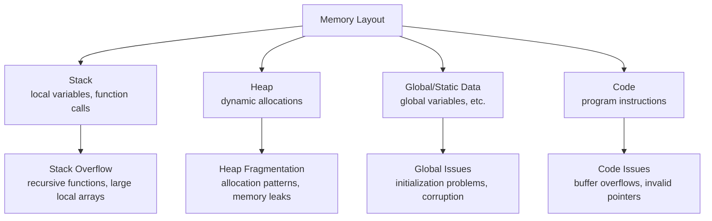
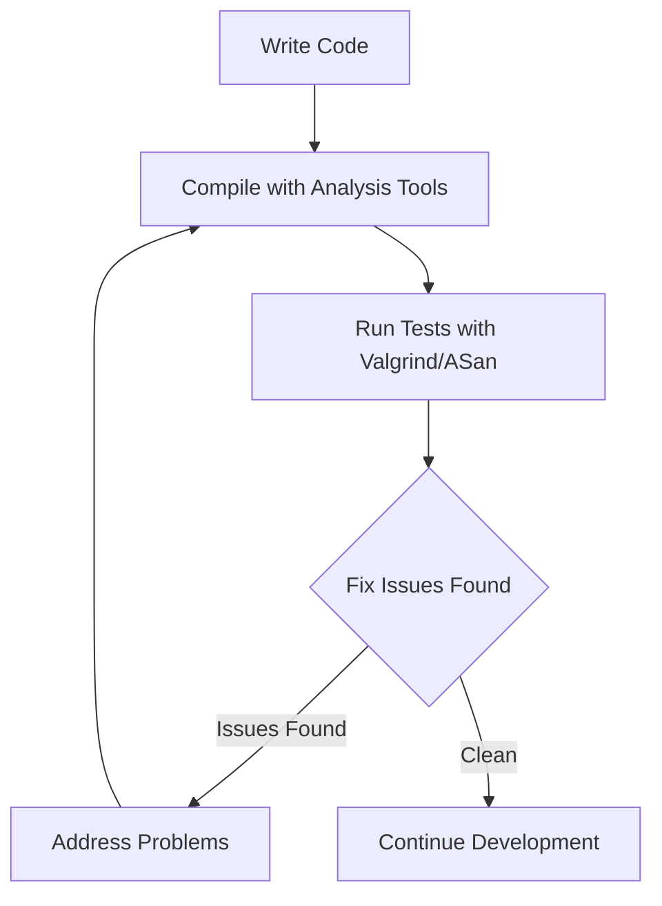

> ## 🚀 Practice & deep-dive on EmbeddedInterviewLab
>
> Study the interactive version of these advanced-hardware topics — ranked interview questions and deep-dive guides.
>
> 👉 **[Open the Interview Question Bank →](https://embeddedinterviewlab.com/questions?utm_source=github&utm_medium=referral&utm_campaign=kb_cta&utm_content=advanced_hardware)** &nbsp;·&nbsp; **[Read the topic guides →](https://embeddedinterviewlab.com/topics?utm_source=github&utm_medium=referral&utm_campaign=kb_cta&utm_content=advanced_hardware)**

---

# Advanced Analysis Tools

> **Deep Code Analysis for Robust Embedded Systems**  
> Understanding how to use advanced analysis tools to find bugs and improve code quality

---

## 📋 **Table of Contents**

- [🎯 Quick Cap](#quick-cap) - What is this and why do interviewers care?
- [🔍 Deep Dive](#deep-dive) - Technical details you need to know
- [💼 Interview Focus](#interview-focus) - Common questions and how to answer them
- [🧪 Practice](#practice) - Test your knowledge with problems and scenarios
- [🏭 Real-World Tie-In](#real-world-tie-in) - How this applies in actual embedded jobs
- [✅ Checklist](#checklist) - Are you ready for interviews on this topic?
- [📚 Extra Resources](#extra-resources) - Where to learn more

---

## 🎯 Quick Cap

Advanced analysis tools are specialized software utilities that detect bugs, memory issues, and code quality problems in embedded systems before they reach production. Embedded engineers care about these tools because they catch critical bugs that could cause system failures, security vulnerabilities, or safety issues in resource-constrained environments. In automotive systems, these tools help prevent software bugs that could lead to brake system failures or unintended acceleration.

## 🔍 Deep Dive

### 🎯 **Analysis Philosophy**

#### **Why Static and Dynamic Analysis Matter**

In embedded systems, bugs can be catastrophic. A simple buffer overflow might cause a medical device to malfunction or a car's braking system to fail. Analysis tools help catch these issues before they reach production.

**The Analysis Mindset**

Analysis isn't about finding every possible bug—it's about finding the bugs that matter most. Focus on:
- **Security vulnerabilities** that could be exploited
- **Memory issues** that cause crashes or corruption
- **Logic errors** that lead to incorrect behavior
- **Performance problems** that affect system reliability

### 🔍 **Static Analysis Tools**

#### **AddressSanitizer: Memory Error Detection**

AddressSanitizer (ASan) is like having a security guard that watches every memory access. It can detect:
- Buffer overflows
- Use-after-free errors
- Double-free errors
- Memory leaks

#### **How ASan Works**

ASan adds instrumentation to your code that tracks memory allocations and accesses:

```c
// Original code
void process_data(char* buffer, int size) {
    for (int i = 0; i <= size; i++) {  // Bug: <= instead of <
        buffer[i] = 'A';  // Buffer overflow!
    }
}

// ASan-instrumented code (conceptually)
void process_data(char* buffer, int size) {
    for (int i = 0; i <= size; i++) {
        if (i >= allocated_size) {
            report_error("Buffer overflow detected");
            return;
        }
        buffer[i] = 'A';
    }
}
```

#### **Using ASan in Practice**

```bash
# Compile with AddressSanitizer
gcc -fsanitize=address -g -O0 -o program program.c

# Run the program
./program

# ASan will report errors like:
# ==12345== ERROR: AddressSanitizer: buffer overflow
# ==12345== WRITE of size 1 at 0x60200000eff8 thread T0
# ==12345== Address 0x60200000eff8 is located 0 bytes to the right of 10-byte region
```

### 🚀 **Dynamic Analysis Tools**

#### **Valgrind: Comprehensive Memory Analysis**

Valgrind is the Swiss Army knife of dynamic analysis. It can:
- Detect memory leaks
- Find uninitialized memory usage
- Identify invalid memory accesses
- Profile memory usage patterns

#### **Memory Leak Detection**

```c
// Common memory leak pattern
void create_sensor_data() {
    SensorData* data = malloc(sizeof(SensorData));
    if (data) {
        data->timestamp = get_current_time();
        data->value = read_sensor();
        
        // Process data...
        
        // Oops! We forgot to free the data
        // This creates a memory leak
    }
}
```

**Valgrind Output:**
```
==12345== HEAP SUMMARY:
==12345==     in use at exit: 64 bytes in 1 blocks
==12345==   total heap usage: 1 allocs, 0 frees, 64 bytes allocated

==12345== 64 bytes in 1 blocks are definitely lost in loss record 1 of 1
==12345==    at 0x4C2AB80: malloc (in /usr/lib/valgrind/vgpreload_memcheck-amd64-linux.so)
==12345==    at 0x400544: create_sensor_data (main.c:15)
==12345==    at 0x4005A2: main (main.c:25)
```

#### **Uninitialized Memory Detection**

```c
// Uninitialized memory usage
void process_buffer(int* buffer, int size) {
    int sum = 0;
    for (int i = 0; i < size; i++) {
        sum += buffer[i];  // Reading uninitialized memory!
    }
    printf("Sum: %d\n", sum);
}

int main() {
    int buffer[100];
    // We forgot to initialize the buffer
    process_buffer(buffer, 100);
    return 0;
}
```

**Valgrind Output:**
```
==12345== Conditional jump or move depends on uninitialised value(s)
==12345==    at 0x400544: process_buffer (main.c:15)
==12345==    at 0x4005A2: main (main.c:25)
```

### 🧠 **Memory Analysis Deep Dive**

#### **Understanding Memory Layout**

To understand memory issues, you need to know how memory is organized:



#### **Common Memory Issues**

**1. Stack Overflow**
```c
// Recursive function without base case
void infinite_recursion() {
    int local_var = 42;
    infinite_recursion();  // Stack grows until overflow
}
```

**2. Heap Fragmentation**
```c
// Allocate and free memory in patterns that create holes
for (int i = 0; i < 1000; i++) {
    void* ptr1 = malloc(100);
    void* ptr2 = malloc(100);
    free(ptr1);  // Creates fragmentation
    // ptr2 remains allocated
}
```

**3. Use After Free**
```c
void* ptr = malloc(100);
free(ptr);
// ptr is now dangling
*((int*)ptr) = 42;  // Writing to freed memory!
```

### 🛠️ **Practical Integration**

#### **Integrating Analysis Tools in Your Workflow**

**Development Workflow**



#### **Makefile Integration**

```makefile
# Analysis targets
analyze: CFLAGS += -fsanitize=address -g -O0
analyze: program
	./program

valgrind: program
	valgrind --tool=memcheck --leak-check=full ./program

asan: CFLAGS += -fsanitize=address -g -O0
asan: program
	ASAN_OPTIONS=detect_leaks=1 ./program
```

#### **Continuous Integration**

```yaml
# GitHub Actions example
name: Code Analysis
on: [push, pull_request]

jobs:
  analyze:
    runs-on: ubuntu-latest
    steps:
      - uses: actions/checkout@v2
      - name: Build with ASan
        run: |
          make CFLAGS="-fsanitize=address -g -O0"
      - name: Run with Valgrind
        run: |
          make valgrind
      - name: Run tests with ASan
        run: |
          make asan
```

### Common Pitfalls & Misconceptions

<Callout>
**Pitfall: Ignoring Analysis Tool Warnings**
Many developers dismiss analysis tool warnings as false positives, but in embedded systems, these warnings often indicate real problems that could cause field failures.

**Misconception: Analysis Tools Slow Down Development**
While analysis tools add compilation time, they save significant debugging time by catching issues early. The investment in setup pays dividends in reduced field failures.
</Callout>

### Performance vs. Resource Trade-offs

| Tool | Performance Impact | Memory Overhead | Detection Capability |
|------|-------------------|-----------------|-------------------|
| **AddressSanitizer** | 2-3x slower | 2-3x memory usage | Excellent memory error detection |
| **Valgrind** | 10-20x slower | 2-4x memory usage | Comprehensive analysis |
| **Static analyzers** | Minimal impact | No runtime overhead | Good for code quality issues |

**What embedded interviewers want to hear is** that you understand the importance of analysis tools in catching critical bugs early, that you integrate them into your development workflow, and that you can interpret their output to fix real issues rather than dismissing warnings as false positives.

## 💼 Interview Focus

### Classic Embedded Interview Questions

1. **"How do you debug memory issues in embedded systems?"**
2. **"What's the difference between static and dynamic analysis?"**
3. **"How would you integrate analysis tools into a continuous integration pipeline?"**
4. **"What do you do when an analysis tool reports a warning you think is a false positive?"**
5. **"How do you choose between different analysis tools for a project?"**

### Model Answer Starters

1. **"I start with static analysis tools like AddressSanitizer during development to catch memory errors early, then use dynamic tools like Valgrind for comprehensive testing..."**
2. **"Static analysis examines code without execution to find potential issues, while dynamic analysis runs the code and monitors actual behavior for runtime problems..."**
3. **"I integrate analysis tools into the build process using Makefile targets and CI/CD pipelines to ensure every code change is automatically analyzed..."**

### Trap Alerts

- **Trap**: Dismissing all analysis tool warnings as false positives
- **Trap**: Only using one analysis tool instead of multiple complementary tools
- **Trap**: Not understanding the performance impact of analysis tools in resource-constrained systems

## 🧪 Practice

<Quiz>
**Question**: Which analysis tool would be most effective for detecting a buffer overflow that only occurs under specific timing conditions?

A) Static analysis only
B) AddressSanitizer
C) Valgrind
D) Code review

**Answer**: B) AddressSanitizer. While static analysis might catch obvious buffer overflows, timing-dependent issues require runtime analysis. AddressSanitizer provides excellent memory error detection with reasonable performance overhead, making it ideal for catching these types of bugs.
</Quiz>

### Coding Task
Implement a circular buffer with proper bounds checking and use AddressSanitizer to verify there are no memory errors:

```c
// Implement this circular buffer structure
typedef struct {
    uint8_t* buffer;
    size_t size;
    size_t head;
    size_t tail;
    size_t count;
} CircularBuffer;

// Your tasks:
// 1. Implement CircularBuffer_init()
// 2. Implement CircularBuffer_push() with bounds checking
// 3. Implement CircularBuffer_pop() with bounds checking
// 4. Compile with AddressSanitizer and test edge cases
```

### Debugging Scenario
Your embedded system is experiencing intermittent crashes after running for several hours. The crash dump shows corrupted stack data. Using analysis tools, how would you approach debugging this issue?

### System Design Question
Design a development workflow that incorporates multiple analysis tools while maintaining reasonable build times for a resource-constrained embedded project.

## 🏭 Real-World Tie-In

### In Embedded Development
At Tesla, analysis tools are mandatory for all automotive software. The team uses AddressSanitizer during development and testing phases to catch memory errors that could affect vehicle safety systems. This proactive approach has prevented numerous potential field issues.

### On the Production Line
In medical device manufacturing, analysis tools are integrated into the build process to ensure every firmware release meets safety standards. A leading medical device company discovered a critical memory leak using Valgrind that would have caused device failures after extended operation periods.

### In the Industry
The aerospace industry requires comprehensive code analysis as part of DO-178C certification. Analysis tools help demonstrate that software meets the required safety levels by identifying potential failure modes before they can cause system malfunctions.

## ✅ Checklist

<Checklist>
- [ ] Understand the difference between static and dynamic analysis
- [ ] Know how to integrate AddressSanitizer into your build process
- [ ] Be able to interpret Valgrind output and fix memory issues
- [ ] Set up analysis tools in continuous integration pipelines
- [ ] Know when to use different analysis tools for different problems
- [ ] Understand the performance trade-offs of analysis tools
- [ ] Be able to distinguish real issues from false positives
</Checklist>

## 📚 Extra Resources

### Recommended Reading

- **"Systems Performance" by Brendan Gregg** - Comprehensive guide to system profiling
- **"Performance and Scalability" by Martin Thompson** - Performance engineering principles
- **"The Art of Computer Systems Performance Analysis" by Raj Jain** - Statistical analysis of performance data

### Online Resources

- **perf-tools** - Collection of performance analysis tools
- **FlameGraph** - Flame graph generation tools
- **Valgrind documentation** - Comprehensive memory analysis guide

### Practice Exercises

1. **Profile a simple sorting algorithm** - Compare bubble sort vs. quicksort
2. **Find memory leaks** - Intentionally create leaks and use Valgrind to find them
3. **Optimize matrix multiplication** - Use perf to identify cache issues
4. **Create flame graphs** - Profile a multi-threaded application

---

**Next Topic**: [Embedded Security Fundamentals](./Embedded_Security/Security_Fundamentals.md) → [Secure Boot and Chain of Trust](./Embedded_Security/Secure_Boot_Chain_Trust.md)
