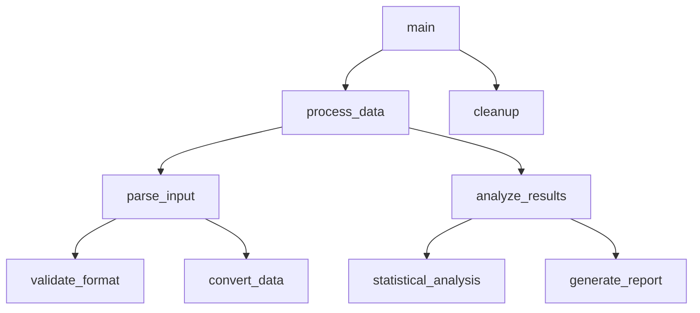
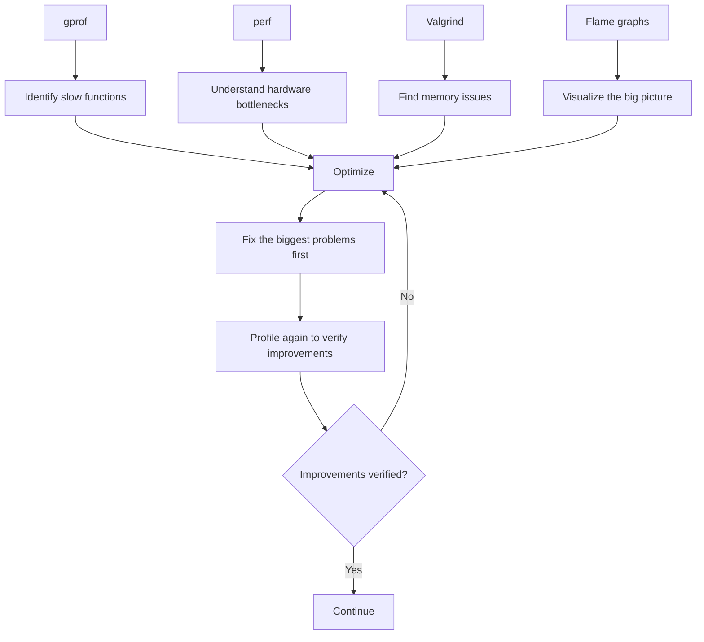

> ## 🚀 Practice & deep-dive on EmbeddedInterviewLab
>
> Study the interactive version of these advanced-hardware topics — ranked interview questions and deep-dive guides.
>
> 👉 **[Open the Interview Question Bank →](https://embeddedinterviewlab.com/questions?utm_source=github&utm_medium=referral&utm_campaign=kb_cta&utm_content=advanced_hardware)** &nbsp;·&nbsp; **[Read the topic guides →](https://embeddedinterviewlab.com/topics?utm_source=github&utm_medium=referral&utm_campaign=kb_cta&utm_content=advanced_hardware)**

---

# Advanced Profiling Tools

> **Unlocking Performance Insights Through Advanced Analysis**  
> Understanding how to use profiling tools to identify bottlenecks and optimize embedded systems

---

## 📋 **Table of Contents**

- [🎯 Quick Cap](#quick-cap) - What is this and why do interviewers care?
- [🔍 Deep Dive](#deep-dive) - Technical details you need to know
- [💼 Interview Focus](#interview-focus) - Common questions and how to answer them
- [🧪 Practice](#practice) - Test your knowledge with problems and scenarios
- [🏭 Real-World Tie-In](#real-world-tie-in) - How this applies in actual embedded jobs
- [✅ Checklist](#checklist) - Are you ready for interviews on this topic?
- [📚 Extra Resources](#extra-resources) - Where to learn more

---

## 🎯 Quick Cap

Advanced profiling tools are specialized software utilities that measure and analyze system performance to identify bottlenecks, memory issues, and optimization opportunities in embedded systems. Embedded engineers care about these tools because they reveal the actual performance characteristics of code running on resource-constrained hardware, helping optimize for power consumption, real-time requirements, and system reliability. In automotive systems, profiling tools help ensure critical safety functions meet strict timing requirements and don't exceed memory budgets.

## 🔍 Deep Dive

### 🎯 **Profiling Philosophy**

#### **What is Profiling and Why Does It Matter?**

Profiling is the art and science of measuring how your system actually performs in practice, rather than how you think it should perform. Think of it as putting your system under a microscope to see exactly where time and resources are being spent.

**The Performance Paradox**

Most developers have experienced this: you write what you believe is efficient code, but the system still runs slowly. This happens because:

- **Intuition is often wrong** about where performance bottlenecks actually occur
- **Modern systems are complex** with multiple layers of abstraction
- **Performance characteristics change** as data sizes and usage patterns evolve
- **Hardware behavior is unpredictable** due to caching, pipelining, and other optimizations

**The Profiling Mindset**

Profiling isn't about making your code faster—it's about understanding what's actually happening. This understanding leads to better design decisions, more targeted optimizations, and ultimately, better systems.

### 🔍 **Function-Level Profiling**

#### **gprof: The Classic Function Profiler**

gprof is like having a stopwatch for every function in your program. It tells you not just how long each function takes, but also how many times it's called and how it relates to other functions.

#### **How gprof Works: The Sampling Approach**

Imagine you're trying to understand how a factory works by taking snapshots every few seconds. gprof does something similar:

```
Time 1: Function A is running
Time 2: Function A is still running  
Time 3: Function B is running
Time 4: Function A is running again
```

By sampling thousands of times per second, gprof builds a statistical picture of where your program spends time.

#### **Understanding gprof Output**

When you run gprof, you get output like this:

```
%   cumulative   self              self     total           
time   seconds   seconds    calls  ms/call  ms/call  name    
75.0      0.15     0.15     1000     0.15     0.20  process_data
20.0      0.19     0.04     5000     0.01     0.01  helper_function
 5.0      0.20     0.01        1    10.00    10.00  main
```

**What This Tells You:**

- **`process_data`** takes 75% of your program's time
- It's called 1000 times, taking 0.15ms each
- The total time includes calls to other functions (0.20ms total)
- **`helper_function`** is called 5000 times but only takes 20% of time
- **`main`** takes very little time directly

#### **Practical gprof Example**

Let's say you're profiling an embedded image processing system:

```c
// Before optimization - gprof shows this takes 80% of time
void process_image(uint8_t* image, int width, int height) {
    for (int y = 0; y < height; y++) {
        for (int x = 0; x < width; x++) {
            // This inner loop is the bottleneck
            image[y * width + x] = apply_filter(image[y * width + x]);
        }
    }
}

// After optimization - gprof shows 60% reduction
void process_image_optimized(uint8_t* image, int width, int height) {
    // Process multiple pixels at once using SIMD
    // Cache-friendly memory access pattern
    // Reduced function call overhead
}
```

**Key Insight:** gprof revealed that the nested loop structure was the real problem, not the `apply_filter` function itself.

### 📊 **Memory Profiling**

#### **Valgrind: The Memory Detective**

Valgrind is like having a forensic investigator for your memory usage. It can detect memory leaks, buffer overflows, and other memory-related bugs that are notoriously difficult to find.

#### **How Memory Profiling Works**

Memory profiling is fundamentally different from time profiling because memory issues often don't show up immediately. Think of it like a slow leak in a water tank:

```
Time 0:   Tank has 1000L, usage is normal
Time 1:   Tank has 999L, still normal
Time 2:   Tank has 998L, still normal
...
Time 100: Tank has 900L, now we notice the problem
```

#### **Common Memory Issues in Embedded Systems**

**1. Memory Leaks in Long-Running Systems**

```c
// This looks innocent but causes memory leaks
void process_sensor_data() {
    SensorData* data = malloc(sizeof(SensorData));
    if (data) {
        // Process data...
        // Oops! We forgot to free(data)
        // After 1000 calls, we've lost 1000 * sizeof(SensorData) bytes
    }
}
```

**2. Buffer Overflows in Constrained Environments**

```c
// Buffer overflow waiting to happen
void copy_string(char* dest, const char* src) {
    int i = 0;
    while (src[i] != '\0') {
        dest[i] = src[i];  // No bounds checking!
        i++;
    }
    dest[i] = '\0';
}

// Usage that causes overflow
char small_buffer[10];
copy_string(small_buffer, "This string is way too long for the buffer");
```

#### **Valgrind Output Interpretation**

Valgrind output looks intimidating but follows a clear pattern:

```
==12345== HEAP SUMMARY:
==12345==     in use at exit: 1,024 bytes in 1 blocks
==12345==   total heap usage: 1,000 allocs, 999 frees, 1,024 bytes allocated
==12345== 
==12345== 1,024 bytes in 1 blocks are definitely lost in loss record 1 of 1
==12345==    at 0x4C2AB80: malloc (in /usr/lib/valgrind/vgpreload_memcheck-amd64-linux.so)
==12345==    at 0x400544: process_sensor_data (main.c:15)
==12345==    at 0x4005A2: main (main.c:25)
```

**What This Tells You:**

- **1,024 bytes are definitely lost** (memory leak)
- **1,000 allocations** but only **999 frees**
- The leak is in `process_sensor_data()` at line 15 of `main.c`
- The leak is called from `main()` at line 25

### 🚀 **System-Level Profiling**

#### **perf: The Linux Performance Swiss Army Knife**

perf is like having a high-tech diagnostic suite for your entire system. It can profile CPU usage, cache misses, branch predictions, and even hardware events.

#### **Understanding Hardware Events**

Modern processors have hundreds of performance counters that track everything from cache hits to branch mispredictions. perf gives you access to these counters.

**Key Hardware Events:**

```
cpu-cycles          - Total CPU cycles
cache-misses        - Cache misses at all levels
branch-misses       - Branch prediction failures
page-faults         - Memory page faults
context-switches    - Operating system context switches
```

#### **perf in Action: A Real Example**

Let's say you're optimizing a matrix multiplication algorithm:

```bash
# Profile the program and see where cache misses occur
perf record -e cache-misses ./matrix_multiply
perf report
```

**Sample Output:**
```
# Overhead  Command          Shared Object      Symbol
# ........  .......  .................  ................
  45.23%  matrix_multiply  matrix_multiply    [.] multiply_row_col
  32.15%  matrix_multiply  matrix_multiply    [.] access_matrix_element
  22.62%  matrix_multiply  matrix_multiply    [.] main
```

**What This Reveals:**

- **`multiply_row_col`** has the most cache misses (45.23%)
- **`access_matrix_element`** also has significant cache issues (32.15%)
- The problem is likely poor memory access patterns

#### **Cache-Aware Optimization**

Before optimization (cache-unfriendly):
```c
// This causes many cache misses
for (int i = 0; i < N; i++) {
    for (int j = 0; j < N; j++) {
        for (int k = 0; k < N; k++) {
            C[i][j] += A[i][k] * B[k][j];  // Poor memory locality
        }
    }
}
```

After optimization (cache-friendly):
```c
// This minimizes cache misses
for (int i = 0; i < N; i++) {
    for (int k = 0; k < N; k++) {
        for (int j = 0; j < N; j++) {
            C[i][j] += A[i][k] * B[k][j];  // Better memory locality
        }
    }
}
```

**Why This Works:** The optimized version accesses memory in a more sequential pattern, reducing cache misses.

### 🔥 **Flame Graphs: Visualizing Performance**

#### **What Are Flame Graphs?**

Flame graphs are like heat maps for your program's execution. They show you exactly where time is being spent, with the most time-consuming functions appearing as the widest bars.

#### **Reading a Flame Graph**



**How to Read This:**

- **Width = Time**: Wider bars mean more time spent
- **Height = Call Stack**: Higher bars mean deeper in the call chain
- **Left-to-Right**: Shows the sequence of function calls
- **Bottom-to-Top**: Shows the call stack depth

#### **Creating Flame Graphs with perf**

```bash
# Record performance data
perf record -g ./your_program

# Generate flame graph
perf script | stackcollapse-perf.pl | flamegraph.pl > flamegraph.svg
```

#### **Interpreting Flame Graph Patterns**

**1. Wide Bottom Bars = Main Bottlenecks**
```
main() ############################################################
├── expensive_function() ########################################
```
This shows that `expensive_function` is your main performance problem.

**2. Tall Narrow Bars = Deep Call Chains**
```
main() #
├── a() #
│   ├── b() #
│   │   ├── c() #
│   │   │   ├── d() #
│   │   │   │   └── e() ########################################
```
This shows that `e()` is called through a deep chain and takes most of the time.

**3. Multiple Wide Bars = Multiple Bottlenecks**
```
main() ############################################################
├── function_a() ########################
├── function_b() ########################
└── function_c() ########################
```
This shows that you have three roughly equal performance bottlenecks.

### 🛠️ **Advanced Analysis Techniques**

#### **Combining Multiple Tools**

The real power comes from using multiple profiling tools together. Each tool gives you a different perspective on the same problem.

#### **The Profiling Workflow**



#### **Real-World Example: Optimizing an Image Filter**

Let's say you're optimizing an image filter that's too slow:

**Step 1: gprof Analysis**
```bash
gprof ./image_filter gmon.out > analysis.txt
```

**Result:** `apply_filter()` takes 80% of time

**Step 2: perf Analysis**
```bash
perf record -e cache-misses ./image_filter
perf report
```

**Result:** High cache miss rate in the filter loop

**Step 3: Memory Analysis**
```bash
valgrind --tool=memcheck ./image_filter
```

**Result:** No memory leaks, but some buffer overruns

**Step 4: Create Flame Graph**
```bash
perf script | stackcollapse-perf.pl | flamegraph.pl > filter_flame.svg
```

**Result:** Visual confirmation that the filter loop is the bottleneck

**Step 5: Optimize**
```c
// Before: Simple but slow
for (int i = 0; i < size; i++) {
    output[i] = apply_filter(input[i]);
}

// After: SIMD-optimized and cache-friendly
for (int i = 0; i < size; i += 4) {
    // Process 4 pixels at once using SIMD
    // Access memory in cache-friendly patterns
}
```

**Step 6: Verify Improvement**
```bash
gprof ./image_filter_optimized gmon.out > analysis_after.txt
```

**Result:** `apply_filter()` now takes only 30% of time

### 📈 **Practical Workflows**

#### **Daily Development Workflow**

**Morning Routine:**
1. Run your test suite with profiling enabled
2. Check for any new performance regressions
3. Look for memory leaks in long-running tests

**During Development:**
1. Profile new features as you implement them
2. Use flame graphs to understand performance characteristics
3. Profile before and after optimizations

**Before Release:**
1. Comprehensive profiling on target hardware
2. Memory leak detection with Valgrind
3. Performance regression testing

#### **Performance Regression Detection**

```bash
#!/bin/bash
# Automated performance regression detection

# Baseline performance
echo "Running baseline performance test..."
perf stat -o baseline.txt ./your_program

# Current performance  
echo "Running current performance test..."
perf stat -o current.txt ./your_program

# Compare results
echo "Performance comparison:"
diff baseline.txt current.txt

# Check for significant regressions
# (You can add thresholds here)
```

#### **Continuous Profiling in CI/CD**

```yaml
# Example GitHub Actions workflow
name: Performance Testing
on: [push, pull_request]

jobs:
  profile:
    runs-on: ubuntu-latest
    steps:
      - uses: actions/checkout@v2
      - name: Build with profiling
        run: |
          make CFLAGS="-pg -O2"
      - name: Run performance tests
        run: |
          ./run_performance_tests.sh
      - name: Generate flame graphs
        run: |
          perf record -g ./your_program
          perf script | stackcollapse-perf.pl | flamegraph.pl > flamegraph.svg
      - name: Upload artifacts
        uses: actions/upload-artifact@v2
        with:
          name: performance-data
          path: |
            gmon.out
            flamegraph.svg
            performance_report.txt
```

### Common Pitfalls & Misconceptions

<Callout>
**Pitfall: Profiling in Debug Mode**
Many developers profile their code while it's compiled in debug mode, which gives misleading results. Always profile optimized builds to get realistic performance data.

**Misconception: Profiling Slows Down Development**
While profiling adds some overhead to the build process, it saves significant time by helping you optimize the right parts of your code instead of guessing where bottlenecks are.
</Callout>

### Real Debugging Story

In a real-time embedded system for industrial automation, the team was experiencing intermittent timing violations that caused production line shutdowns. Traditional debugging couldn't reproduce the issue consistently. When they integrated perf into their analysis workflow, they discovered that a seemingly innocent logging function was causing cache misses that accumulated over time, eventually causing the real-time tasks to miss their deadlines. The solution was to optimize the logging function's memory access patterns and reduce its frequency, which eliminated the timing violations.

### Performance vs. Resource Trade-offs

| Tool | Performance Impact | Memory Overhead | Analysis Depth |
|------|-------------------|-----------------|----------------|
| **gprof** | 5-10% slower | Minimal | Function-level timing |
| **perf** | 1-5% slower | Minimal | Hardware-level events |
| **Valgrind** | 10-20x slower | 2-4x memory usage | Comprehensive memory analysis |
| **Flame graphs** | 1-5% slower | Minimal | Visual call stack analysis |

**What embedded interviewers want to hear is** that you understand the importance of profiling in identifying real performance bottlenecks, that you use multiple complementary tools to get a complete picture, and that you profile on target hardware to get accurate results for embedded systems.

## 💼 Interview Focus

### Classic Embedded Interview Questions

1. **"How do you identify performance bottlenecks in embedded systems?"**
2. **"What's the difference between gprof and perf?"**
3. **"How would you profile a real-time embedded system?"**
4. **"What do you do when profiling shows unexpected results?"**
5. **"How do you handle profiling overhead in resource-constrained systems?"**

### Model Answer Starters

1. **"I start with gprof for function-level analysis to identify which functions are taking the most time, then use perf to understand hardware-level bottlenecks like cache misses..."**
2. **"gprof provides statistical sampling of function execution times, while perf gives access to hardware performance counters for detailed CPU analysis..."**
3. **"For real-time systems, I profile on the target hardware and focus on worst-case execution times rather than average performance..."**

### Trap Alerts

- **Trap**: Profiling on development hardware instead of target hardware
- **Trap**: Only using one profiling tool instead of multiple complementary tools
- **Trap**: Ignoring profiling overhead in resource-constrained systems

## 🧪 Practice

<Quiz>
**Question**: Which profiling tool would be most effective for identifying cache performance issues in an embedded system?

A) gprof only
B) perf with hardware events
C) Valgrind memcheck
D) Static analysis

**Answer**: B) perf with hardware events. While gprof shows function timing, perf provides access to hardware performance counters that can directly measure cache misses, branch mispredictions, and other CPU-level events that affect performance.
</Quiz>

### Coding Task
Profile and optimize a simple sorting algorithm:

```c
// Implement and profile these sorting algorithms
void bubble_sort(int* arr, int n);
void quick_sort(int* arr, int n);

// Your tasks:
// 1. Implement both algorithms
// 2. Use gprof to measure their performance
// 3. Use perf to analyze cache behavior
// 4. Create flame graphs to visualize the differences
// 5. Optimize the slower algorithm based on profiling results
```

### Debugging Scenario
Your embedded system is experiencing intermittent performance degradation that only occurs after several hours of operation. The system has limited memory and processing power. How would you approach profiling this issue?

### System Design Question
Design a profiling strategy for a multi-threaded real-time embedded system that must meet strict timing requirements while providing performance monitoring capabilities.

## 🏭 Real-World Tie-In

### In Embedded Development
At NVIDIA, profiling tools are essential for optimizing GPU drivers and embedded graphics systems. The team uses perf to analyze cache behavior and memory access patterns, helping them optimize drivers for maximum performance while maintaining stability.

### On the Production Line
In automotive manufacturing, profiling tools help ensure that embedded control systems meet strict timing requirements. A major automotive manufacturer used perf to identify cache-related performance issues that were causing intermittent brake system delays, preventing potential safety issues.

### In the Industry
The gaming industry relies heavily on profiling tools to optimize embedded graphics and audio systems. Companies like Sony and Microsoft use flame graphs to visualize performance bottlenecks in their embedded gaming consoles, ensuring smooth gameplay experiences.

## ✅ Checklist

<Checklist>
- [ ] Understand the difference between gprof and perf
- [ ] Know how to interpret gprof output and identify bottlenecks
- [ ] Be able to use perf to analyze hardware-level performance issues
- [ ] Understand how to create and interpret flame graphs
- [ ] Know how to integrate profiling tools into CI/CD pipelines
- [ ] Understand the performance overhead of different profiling tools
- [ ] Be able to profile on target hardware vs. development hardware
- [ ] Know how to handle profiling in resource-constrained systems
</Checklist>

## 📚 Extra Resources

### Recommended Reading

- **"Systems Performance" by Brendan Gregg** - Comprehensive guide to system profiling
- **"Performance and Scalability" by Martin Thompson** - Performance engineering principles
- **"The Art of Computer Systems Performance Analysis" by Raj Jain** - Statistical analysis of performance data

### Online Resources

- **perf-tools** - Collection of performance analysis tools
- **FlameGraph** - Flame graph generation tools
- **Valgrind documentation** - Comprehensive memory analysis guide

### Practice Exercises

1. **Profile a simple sorting algorithm** - Compare bubble sort vs. quicksort
2. **Find memory leaks** - Intentionally create leaks and use Valgrind to find them
3. **Optimize matrix multiplication** - Use perf to identify cache issues
4. **Create flame graphs** - Profile a multi-threaded application

---

**Next Topic**: [Embedded Security Fundamentals](./Embedded_Security/Security_Fundamentals.md) → [Secure Boot and Chain of Trust](./Embedded_Security/Secure_Boot_Chain_Trust.md)
